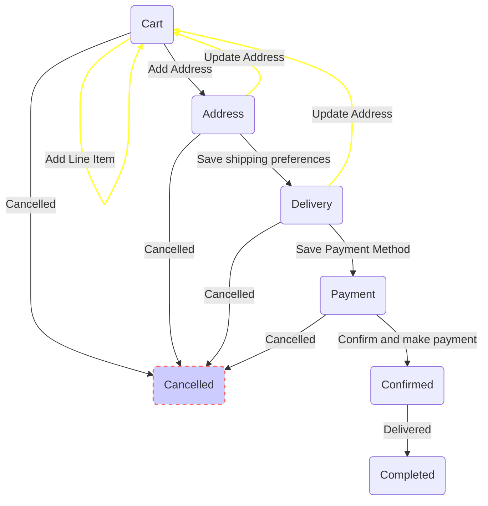

## Order States

### cart
  The `cart` state of the `order` is the state when user has added some line items
  to the `order`. A user (guest/logged-in) is associated with the order.
  In this state address is not associated with the order. The price/total fields may be nil.
  
  __Successors__: `address`, `cancelled`
  
  __Guarantees__:
  Quite literally, none.

  ### address
  As soon as the user adds address to the order the order transitions in to the `address`
  state. The user can add both the billing and shipping addresses. The transition allows
  computation of packages for the order, and it is possible there are no packages that
  fulfill the order.
  
  __Successors__: `delivery`, `cancelled`
  
  __Guarantees__:
    That the addresses are associated with this order packages may/may not exist.
    `item_total` and `tax_total` are set.
    
    total = item_total + tax_total

### delivery
  On addition of address `packages` are created with each package having a set of shipping
  methods to choose from. The user has can chose a shipping method for each package.

  __Successors__: `payment`, `cancelled`, `address`

  __Guarantees__:
  Order total fields are set (and accurate) package total fields are set (and accurate)
  total payable amount can be computed.

### payment
  Since `order` total is calculated the user can now make payment for the `order` amount
  which includes `shipping` as well as all the taxes. The user at this state can chose a
  payment method and add payment details.
  
  __Successors__: `complete`, `cancelled`
  
  __Guarantees__:
  At least one payment record, along with the sub payment-type is created for the order.

### confirmed
  The user has confirmed the order.
  The payment is being captured, and upon confirmation of “payment”, we update the stocks, etc.
  
  __Successors__: `completed`

  __Guarantees__:
  The payment state-machine has been triggered to capture the amount. In case of `cash on delivery`
  payment order is automatically confirmed.
  Stocks will be locked for this order.
  The user can no longer edit line items.

### completed
The `order` is marked as completed when all the `packages` have been delivered.

### cancelled
The user has cancelled the order.
The payment/shipment is now being scrapped/reverted/.

__Guarantees__:
The payment state machine has been triggered to void/refund any amount associated
if payment has been made.
The user can no longer edit:
line items
address
shipping preference (since address cannot change)
payment method (obviously)
