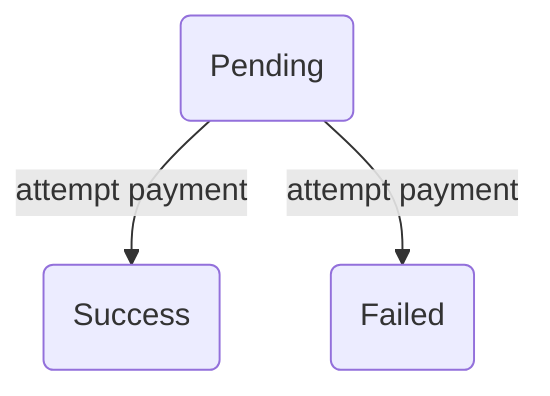

## Overview

Payments in AviaCommerce has been designed in a manner to allow multiple payment methods
to be available to choose from during checkout. The logic for payment processing is
completely detached from order flow to maintain flexibility in the implementation
of the payment processing logic.

To track `payments` for `orders` a [supertype subtype modelling][1] is used.
The `payment` model stores the details which are usually common for all payment types
whereas the type-specific information is stored in the corresponding `subtype`.

The different subtypes are:
- `cash on delivery`
- `hosted payment`
- `store credits`
- `card`

An `order` can be paid through multiple payment methods. This has been done keeping
in mind the functionality for store credits, which gives customers a way to utilize the store
credits for payment.

The `payments` model has the following attributes:
- `slug`: A unique identifier to be used while sending the information to the
   payment gateway for processing. Some gateways report duplicate payments in case a unique identifier is not sent for the payment. This helps maintain the uniqueness.
- `payment_type`: A string identifier for the sub-payment type, `cod`,
   `hosted_payment`, `card` or `store credits`.
- `amount`: The amount to be paid in this payment.
- `state`: It tells about the state the payment is in. See [`Payment States`][2] section.

Payment Relationships:
- **_belongs to_** `payment_method`: It associates the `payment method` used for making the payment.
- **_belongs to_** `order`: It associates the `order` for which the `payment` was
  made.

## Payment Subtypes
The `payment subtypes` hold the type-specific details for the payment made. While creating
a `payment` record for an order the subtype record is created along with the payment record.
To ensure that a payment record is associated with only of the subtypes a DB level check has been put. The `payment type` field in the payment record helps identify the type of
the payment.

The payment subtypes:

### Hosted Payment
Identified by the code `hpm`.

The attributes of the `hosted payment` model:
- `transaction_id`: A unique identifier for the purchase made, at present, the order
number field is used for this.
- `payment_source`: The source for the payment, it refers to the gateway being used
for the payment made. e.g. Payubiz.
- `raw_response`: The entire response from the payment source after the payment is done.

Relationships:
- **_belongs to_** `payment`: Forms the association with the payment record. 

Modules to handle business logic:
- [`Snitch.Data.Model.HostedPayment`][7]: Exposes CRUD functions for hosted payment.
- [`Snitch.Data.Schema.HostedPayment`][8]: Schema for hosted payment.

### Card Payment
Identified by the code `ccd`.

The attributes of the card payment model:
- `response_code`: a string code representing the code usually for success and error.
- `response_message`: the response message for the card payment.
- `avs_response`: address verification response for the purchase.
- `cvv_response`: cvv response for the card.

Relationships:
- **_belongs to_** `payment`: Forms the association with the payment record.
- **_belongs to_** `card`: In case the merchant is PCC compliant then the stored
card can be associated with the card payment.

Modules to handle business logic:
- [`Snitch.Data.Model.CardPayment`][9]: Exposes CRUD functions for card payment.
- [`Snitch.Data.Schema.CardPayment`][10]: Schema for card payment.

### Cash On Delivery
Identified by the code `cod`.

The cash on delivery type doesn't have a dedicated model since all the required
fields are present in the payment record.

### Store Credits
The store credits are not yet supported. Work is in progress for this.  

// TODO  
Update docs once store credits functionality is working.

## Payment Methods
Payment methods represent the various options a user can utilize to make payment for
an order. They can be configured from the admin panel.
All the payment methods are essentially of one of the four main types which are:
- card payments (gateway based)
- cash on delivery
- store credits
- hosted payments(gateway based)

All the above-mentioned types are supported except, store credits.

The processing logic for a payment method is being handled by a separate elixir
library [`avia_payments`][3].

The `payment method` model has the following attributes:
- `name`: the name which would be shown to the user.
- `code`: code to identify the type of the payment.
    See [`SnitchPayments.PaymentMethodCode`][4].
- `active?`: A boolean to determine whether the payment method is active
    or not in the latter case it is not shown to the user.
- `live_mode?`: A boolean to determine whether `test`_url or `live`_url
    should be used for the `provider`.
- `provider`: Stores the name of the module which implements the processing logic
    for handling the transactions. The providers are picked from gateways in
    `SnitchPayments` See [Payment Method Provider][] section for more details.
- `preferences`: A map to store gateway specific fields of the provider.

## Payment Method Provider
  The `provider` field in the `payment method` model refers to the module that
  would be used to handle the processing logic.

  The `provider` field is set from a list of **providers**. The list is exposed
  by the [`SnitchPayments.payment_providers`][6].

## Payment states
The payment can have various states. The default states of payment are pretty simple
which are:
- `pending`: The user has not paid for the order fully.  
  **Successors**: `failed`, `success`  
  **Guarantees**:
  Payment method is selected.

- `success`: The user has fully paid for the particular payment.

- `failed`: The payment did not succeed.

The default payment flow at present is also very simple.

In future, the state machine is being designed in a manner that potentially every
payment type(hosted, cod etc) can have their own payment machine.

Also, payment retry is not being handled at present. In case of a failed payment
for an order, a new payment record is created. Payment retry is in pipeline.

[1]: https://stackoverflow.com/questions/4763141/data-modeling-supertype-subtype
[2]: /docs/payments.html#payment-states
[3]: https://github.com/aviacommerce/avia_payments
[4]: https://github.com/aviacommerce/avia_payments/blob/develop/lib/payment_method_code.ex
[5]: /docs/payments.html#payment-method-provider
[6]: https://github.com/aviacommerce/avia_payments/blob/develop/lib/snitch_payments.ex
[7]: https://github.com/aviacommerce/avia/blob/develop/apps/snitch_core/lib/core/data/model/payment/hosted_payment.ex
[8]: https://github.com/aviacommerce/avia/blob/develop/apps/snitch_core/lib/core/data/schema/payment/hosted_payment.ex
[9]: https://github.com/aviacommerce/avia/blob/develop/apps/snitch_core/lib/core/data/model/payment/card_payment.ex
[10]: https://github.com/aviacommerce/avia/blob/develop/apps/snitch_core/lib/core/data/schema/payment/card_payment.ex

