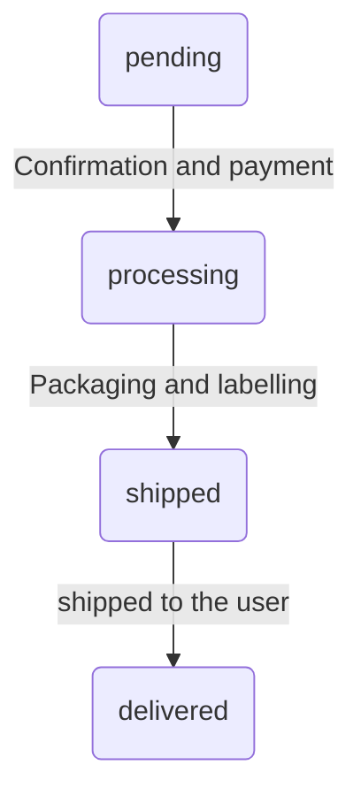

## Overview
Shipment also known as _packages_ are the actual shippable entities of an order that
are delivered to the user. The `package` model represents the shipments in AviaCommerce.

> Package or Shipment refers to the same entity, they have been used interchangeably
  but should be considered the same.

The package model has following attributes:
- `tracking`: It is json field which contains information to track the package once,
    it is shipped.
- `shipping_methods`: The `ShippingMethod`s and their estimated costs, the user chooses one of them
    and the choice is then stored in `shipping_method`.
- `cost`: The shipping cost for the chosen `shipping_method`.
- `shipping_tax`: The shipping tax on this package. This is different from the taxes on the
  constituent package items.
- `state`: The current state of the `packages`. See [Package States][1] for more details.
- `number`: A unique string to identify the package.
- `shipped_at`: It gives the timestamp at which the `package` was shipped.

Relationships:
- **_belongs to_** `order`: Associates the order to which the package belongs.
- **_belongs to_** `shipping_method`: It  associates the preferred _Shipping Method_ chosen for this       package by the user, not to be confused with the `shipping_methods` field.
- **_belongs to_** `origin`: Associates the _Stock Location_ from which the package would
    be shipped.
- **_belongs to_** `shipping_category`: Associates the shipping category.
- **_has many_** `items`: A package has many package items, see [Package Items][2] for details.

#### Package Creation
To create packages for an order the order is passed through a _pipeline_. The pipeline
is made up of three separate modules.
- [`Snitch.Domain.Shipment.default_packages/1`][3]: The function takes the order as input
    and returns a list of potentially shippable packages. It fetches all the stock information (from all stock locations) that is relevant to this order and attempts to fulfill the order separately from each stock location.
- [`Snitch.Domain.ShipmentEngine.run/1`][4]: It takes the list of packages returned from the `default_packages` and finds the most optimum packages under a set of constraints.

The list of shipments returned from the _shipment engine_ are then passed through a series of splitters to split the packages based on some constraints.  
By default there is only one splitter [`Snitch.Domain.Splitters.Weight`][4].

## Package States
The `package`s also pass through a series of states during the order placement and then processing
on the store side.
At present the package state machine is very simple and is not triggering any other machines but we
are working towards a stable machine that would be able to handle complex transitions along with side
effects.

The package states
- `pending`: The packages are created initially in this state.
- `processing`: Once the order is confirmed by the user or the payment is made
   the `packages` are in this stage. During this time the actual package preparation 
   are handled.
- `shipped`: The packages are in this state once the admin marks the order as shipped.
- `delivered`: The packages are marked as delivered once the actual delivery to the user happens.

## Package Items
Every **Line Item** of the order which can be fulfilled(has enough stock), is shipped
as a **Package Item** in the _Package_.

The `package` entity has following attributes:
- `number`: It is a UUID to identify the package.
- `state`: It identifies the state, the states are `fulfilled` and `deferred`.
- `quantity`: The number of units (of this item) that are currently "on hand" at the stock
    location. The package can be shipped only when this becomes equal to the
    quantity ordered. When the item is immediately fulfilled, this is same as the line_item's
    quantity. Otherwise, this is the number of units that are currently "on hand" at the
    origin stock location.
- `delta`: It's the difference between the `quantity` and the number of units "on
    hand".
- `tax`: The tax levied over (or included in) the cost of the line item, as applicable
    when the line item is sold from the `origin` stock location.
- `shipping_tax`: The sum of all shipping taxes that apply for the shipping of this item from
  the `origin` stock location.
- `backordered?`: A boolean to check if the package item _will fulfill_ the
  line item. If it's set to true then it will be fulfilled in the future. 
  The (parent) package cannot be immediately shipped.
  

Relationships:
- **_belongs to_** `product`: Associates the product for which the package item is 
    created.
- **_belongs to_** `line Item`: Associates the line item from the order.
- **_belongs to_** `package`: Associates the package in which the item would be shipped.

[1]: /docs/shipments.html#package-states
[2]: /docs/shipments.html#package-items
[3]: https://github.com/aviacommerce/avia/blob/develop/apps/snitch_core/lib/core/domain/shipment.ex
[4]: https://github.com/aviacommerce/avia/blob/develop/apps/snitch_core/lib/core/domain/splitters/weight.ex
